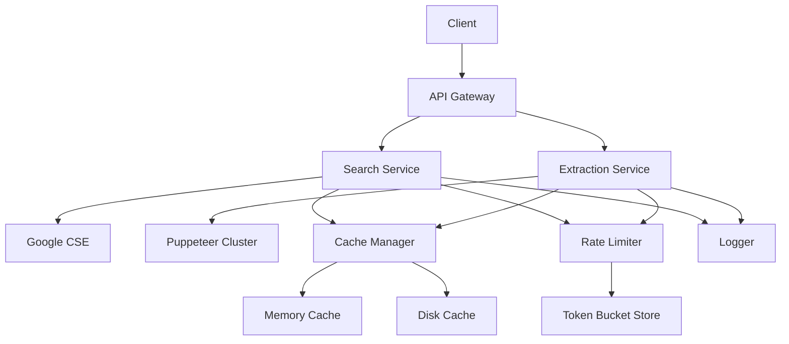
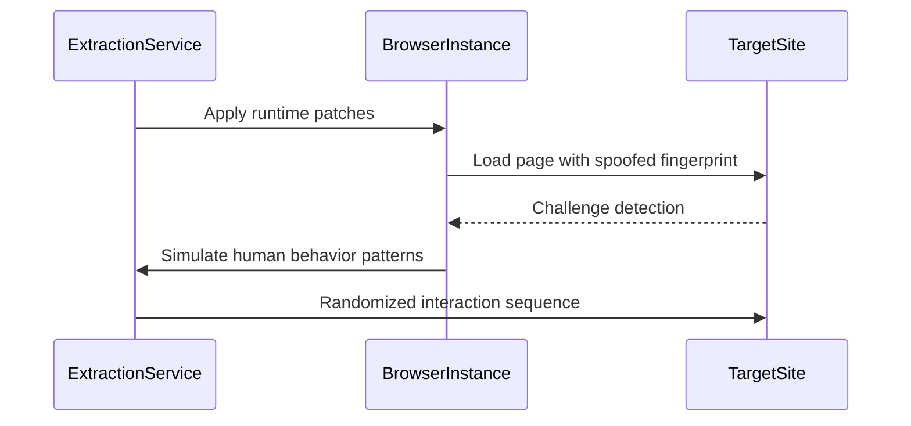
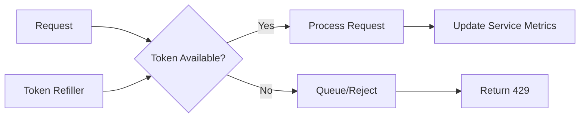
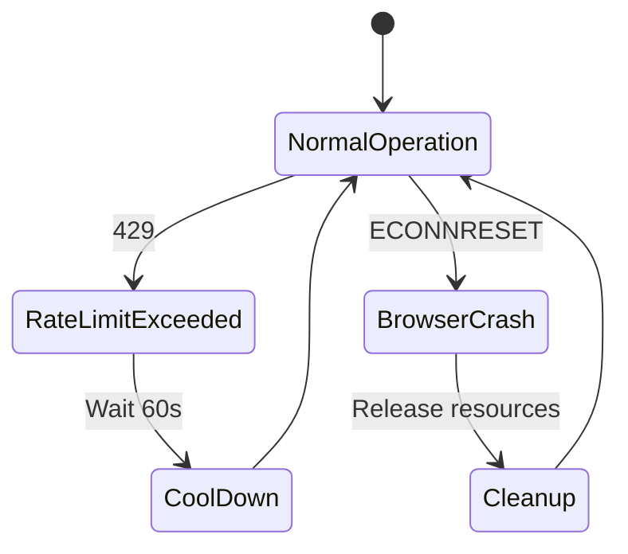
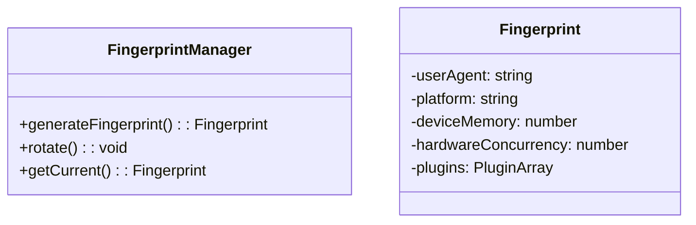
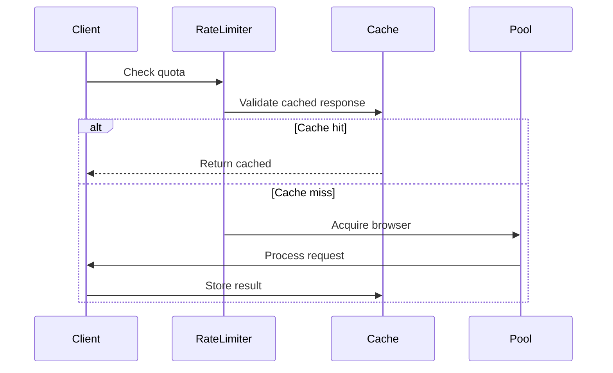

# Google Search MCP - System Architecture Patterns

## High-Level Architecture


## Core Architectural Patterns

### 1. Layered Defense Against Bot Detection


Components:
- **Navigator Proxy**: Masks browser properties using JS Proxy
- **Fingerprint Rotator**: Cycles hardware/profile attributes
- **Behavior Simulator**: Generates human-like interaction patterns

### 2. Connection Pooling Architecture
**Key characteristics:**
- Browser-as-a-Service pattern
- Warm instance maintenance
- Context isolation using utility worlds
- Leak-proof resource handling

```typescript
interface ConnectionPool {
  maxInstances: number
  acquisitionTimeout: number
  recyclingStrategy: 'aggressive' | 'conservative'
  instanceHealthCheck: (browser: Browser) => boolean
}
```

### 3. Rate Limiting Implementation
Token bucket algorithm with service-specific configurations:


### 4. Cache Stratification
Multi-layer caching strategy:
1. **Memory Cache** (LRU, 1s TTL)
2. **Disk Cache** (SSD-optimized, 1h TTL)
3. **Search API Cache** (Google-compliant, 24h TTL)

### 5. Error Recovery Flow


## Cross-Cutting Concerns

### 1. Browser Fingerprint Management


### 2. Human Behavior Simulation
Component | Responsibility | Implementation
---|---|---
MovementGenerator | Mouse path simulation | Bezier curves with random deviation
ScrollPattern | Page scrolling behavior | Randomized acceleration profiles
TimingProfile | Action timing patterns | Erlang-distributed delays

## Recent Architecture Updates

### 1. Enhanced Navigator Proxy
- Property masking using ES6 Proxy
- Dynamic userAgent rotation
- Plugin array simulation
- WebGL fingerprint spoofing

### 2. Connection Pool Improvements
- Instance health monitoring
- Memory usage thresholds
- Automated cleanup cycles
- Context isolation strategies

### 3. Cache-RateLimit-Pooling Triad
Synchronized operation between core infrastructure components:


## Architectural Decisions

1. **Browser Isolation Strategy**
- Decision: Use separate browser instances per request context
- Rationale: Prevents cookie/state leakage between sessions
- Tradeoff: Higher memory usage vs improved security

2. **Cache Invalidation Approach**  
- Decision: TTL-based with query normalization
- Rationale: Balances freshness with performance
- Tradeoff: Potential stale results vs reduced API calls

3. **Human Behavior Simulation**  
- Decision: Client-side pattern generation
- Rationale: Avoids detectable timing patterns
- Tradeoff: Increased complexity vs better evasion